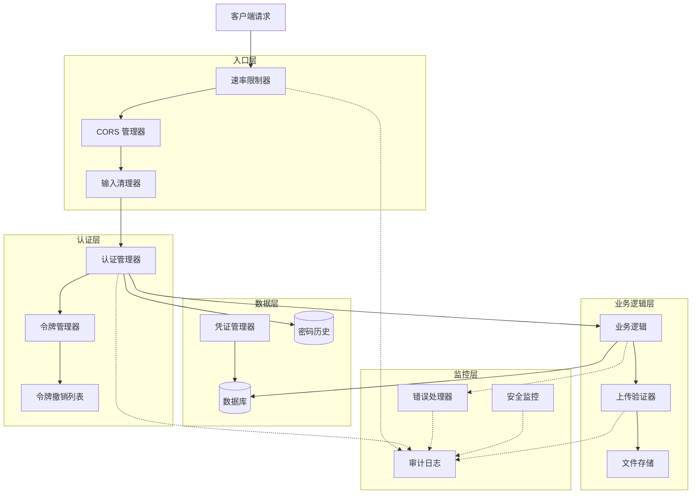

# Design Document: Backend Security Hardening

## Overview

本设计文档描述了对 Yii2 后端应用进行全面安全加固的技术方案。该方案采用分层防御策略，通过实施多个安全控制层来保护应用免受常见安全威胁。

设计遵循以下核心原则：
- **纵深防御**: 实施多层安全控制，确保单点失败不会导致系统完全暴露
- **最小权限**: 每个组件仅获得完成其功能所需的最小权限
- **安全默认**: 所有配置默认采用最安全的设置
- **失败安全**: 当安全检查失败时，系统应拒绝访问而非允许
- **可审计性**: 所有安全相关事件都应被记录和可追溯

## Architecture

### 系统架构图



### 安全层次

1. **入口层**: 处理所有传入请求，实施速率限制、CORS 策略和输入清理
2. **认证层**: 验证用户身份，管理 JWT 令牌和会话
3. **业务逻辑层**: 执行应用功能，包括文件上传和数据处理
4. **数据层**: 安全存储和访问敏感数据
5. **监控层**: 记录和监控所有安全相关事件

## Components and Interfaces

### 1. Credential Manager (凭证管理器)

**职责**: 安全管理所有敏感凭证和配置信息

**接口**:
```php
interface CredentialManagerInterface {
    // 获取数据库凭证
    public function getDatabaseCredentials(): array;
    
    // 获取 JWT 密钥
    public function getJwtSecret(): string;
    
    // 轮换 JWT 密钥
    public function rotateJwtSecret(): void;
    
    // 验证所有必需的环境变量是否存在
    public function validateEnvironment(): bool;
    
    // 获取加密的配置值
    public function getEncryptedConfig(string $key): string;
}
```

**实现细节**:
- 从环境变量加载所有敏感配置
- 使用 PHP 的 `getenv()` 或 `$_ENV` 访问环境变量
- 实施配置验证，确保所有必需的密钥都存在
- 支持 JWT 密钥轮换，旧密钥保留一段时间以支持现有令牌
- 使用 Yii2 的 Security 组件加密存储的配置值

### 2. Upload Validator (上传验证器)

**职责**: 验证和安全处理文件上传

**接口**:
```php
interface UploadValidatorInterface {
    // 验证上传的文件
    public function validate(UploadedFile $file): ValidationResult;
    
    // 生成安全的文件名
    public function generateSafeFilename(string $originalName): string;
    
    // 获取安全的存储路径
    public function getSecureStoragePath(): string;
    
    // 验证 MIME 类型
    public function validateMimeType(UploadedFile $file): bool;
    
    // 扫描文件内容
    public function scanFileContent(UploadedFile $file): bool;
}
```

**实现细节**:
- **MIME 类型白名单**: 
  - 图片: `image/jpeg`, `image/png`, `image/gif`, `image/webp`
  - 文档: `application/pdf`, `application/msword`, `application/vnd.openxmlformats-officedocument.wordprocessingml.document`
  - 压缩文件: `application/zip`, `application/x-rar-compressed`
  
- **文件扩展名白名单**: `.jpg`, `.jpeg`, `.png`, `.gif`, `.webp`, `.pdf`, `.doc`, `.docx`, `.zip`, `.rar`

- **文件大小限制**: 10MB (10485760 bytes)

- **文件名生成**: 使用 `hash('sha256', uniqid('', true) . microtime(true))` 生成唯一文件名

- **内容验证**: 使用 `finfo_file()` 验证实际文件内容与声明的 MIME 类型匹配

- **存储位置**: 文件存储在 web root 之外的专用目录，例如 `/var/uploads/`

- **双扩展名检测**: 拒绝包含多个扩展名的文件（如 `file.php.jpg`）

### 3. Auth Manager (认证管理器)

**职责**: 管理用户认证和授权

**接口**:
```php
interface AuthManagerInterface {
    // 验证用户凭证
    public function authenticate(string $username, string $password): AuthResult;
    
    // 验证密码强度
    public function validatePasswordStrength(string $password): ValidationResult;
    
    // 检查密码历史
    public function checkPasswordHistory(int $userId, string $newPassword): bool;
    
    // 记录失败的登录尝试
    public function recordFailedLogin(string $username, string $ipAddress): void;
    
    // 检查账户是否被锁定
    public function isAccountLocked(string $username): bool;
    
    // 解锁账户
    public function unlockAccount(string $username): void;
    
    // 哈希密码
    public function hashPassword(string $password): string;
    
    // 验证密码
    public function verifyPassword(string $password, string $hash): bool;
}
```

**实现细节**:
- **密码策略**:
  - 最小长度: 12 字符
  - 必须包含: 大写字母、小写字母、数字、特殊字符
  - 密码历史: 保存最近 5 个密码的哈希值
  - 管理员账户密码过期: 90 天
  
- **密码哈希**: 使用 `password_hash()` 和 `PASSWORD_BCRYPT`，cost 因子为 12

- **账户锁定**: 15 分钟内 5 次失败登录后锁定账户 30 分钟

- **弱密码列表**: 维护常见弱密码列表（如 "password123", "admin123" 等）

### 4. Token Manager (令牌管理器)

**职责**: 管理 JWT 令牌的生成、验证和撤销

**接口**:
```php
interface TokenManagerInterface {
    // 生成访问令牌
    public function generateAccessToken(int $userId): string;
    
    // 生成刷新令牌
    public function generateRefreshToken(int $userId): string;
    
    // 验证令牌
    public function validateToken(string $token): TokenValidationResult;
    
    // 刷新访问令牌
    public function refreshAccessToken(string $refreshToken): string;
    
    // 撤销令牌
    public function revokeToken(string $token): void;
    
    // 撤销用户的所有令牌
    public function revokeAllUserTokens(int $userId): void;
    
    // 生成密码重置令牌
    public function generatePasswordResetToken(int $userId): string;
    
    // 验证密码重置令牌
    public function validatePasswordResetToken(string $token): bool;
    
    // 使密码重置令牌失效
    public function invalidatePasswordResetToken(string $token): void;
}
```

**实现细节**:
- **JWT 配置**:
  - 算法: HS256
  - 密钥长度: 至少 256 位（32 字节）
  - 访问令牌过期时间: 1 小时
  - 刷新令牌过期时间: 7 天
  
- **令牌结构**:
  ```json
  {
    "sub": "user_id",
    "iat": "issued_at_timestamp",
    "exp": "expiration_timestamp",
    "jti": "unique_token_id"
  }
  ```

- **令牌撤销**: 使用 Redis 或数据库表维护撤销列表，存储 `jti` (JWT ID)

- **密码重置令牌**: 使用 `random_bytes(32)` 生成，存储哈希值到数据库，1 小时后过期

### 5. Rate Limiter (速率限制器)

**职责**: 限制 API 请求频率，防止滥用

**接口**:
```php
interface RateLimiterInterface {
    // 检查是否超过速率限制
    public function checkLimit(string $identifier, string $action): bool;
    
    // 记录请求
    public function recordRequest(string $identifier, string $action): void;
    
    // 获取剩余请求数
    public function getRemainingRequests(string $identifier, string $action): int;
    
    // 获取重置时间
    public function getResetTime(string $identifier, string $action): int;
}
```

**实现细节**:
- **限制策略**:
  - 每 IP 地址: 100 请求/分钟
  - 每认证用户: 1000 请求/小时
  - 登录端点: 5 请求/15分钟
  
- **实现方式**: 使用滑动窗口算法，基于 Redis 存储请求计数

- **响应头**:
  ```
  X-RateLimit-Limit: 100
  X-RateLimit-Remaining: 95
  X-RateLimit-Reset: 1640000000
  ```

- **超限响应**: HTTP 429 Too Many Requests，包含 `Retry-After` 头

### 6. CORS Manager (CORS 管理器)

**职责**: 管理跨域资源共享策略

**接口**:
```php
interface CorsManagerInterface {
    // 验证来源
    public function validateOrigin(string $origin): bool;
    
    // 获取允许的来源列表
    public function getAllowedOrigins(): array;
    
    // 获取允许的方法
    public function getAllowedMethods(): array;
    
    // 获取允许的头部
    public function getAllowedHeaders(): array;
    
    // 是否允许凭证
    public function allowCredentials(): bool;
}
```

**实现细节**:
- **允许的来源**: 从环境变量读取白名单，生产环境禁止使用 `*`
  
- **允许的方法**: `GET`, `POST`, `PUT`, `DELETE`, `OPTIONS`

- **允许的头部**: `Content-Type`, `Authorization`, `X-Requested-With`

- **凭证支持**: 当允许凭证时，必须指定具体来源（不能使用 `*`）

- **预检请求缓存**: `Access-Control-Max-Age: 3600`

### 7. Input Sanitizer (输入清理器)

**职责**: 清理和验证所有用户输入

**接口**:
```php
interface InputSanitizerInterface {
    // 清理字符串
    public function sanitizeString(string $input): string;
    
    // 清理文件名
    public function sanitizeFilename(string $filename): string;
    
    // 验证数据类型
    public function validateType($input, string $expectedType): bool;
    
    // 清理 HTML
    public function sanitizeHtml(string $html): string;
    
    // 验证路径
    public function validatePath(string $path): bool;
    
    // 清理 SQL 输入（用于动态表名等）
    public function sanitizeSqlIdentifier(string $identifier): string;
}
```

**实现细节**:
- **字符串清理**: 移除 null 字节、控制字符

- **文件名清理**: 
  - 移除路径分隔符 (`/`, `\`)
  - 移除特殊字符 (`<`, `>`, `:`, `"`, `|`, `?`, `*`)
  - 限制长度为 255 字符
  
- **HTML 清理**: 使用 HTMLPurifier 或类似库

- **路径验证**: 检测 `..`, `./`, 绝对路径等路径遍历模式

- **SQL 标识符清理**: 仅允许字母、数字和下划线

### 8. Error Handler (错误处理器)

**职责**: 安全地处理和记录错误

**接口**:
```php
interface ErrorHandlerInterface {
    // 处理异常
    public function handleException(\Throwable $exception): Response;
    
    // 格式化错误响应
    public function formatErrorResponse(\Throwable $exception, bool $isProduction): array;
    
    // 记录错误
    public function logError(\Throwable $exception, array $context): void;
    
    // 发送错误警报
    public function sendAlert(\Throwable $exception): void;
    
    // 过滤敏感信息
    public function filterSensitiveData(array $data): array;
}
```

**实现细节**:
- **生产环境响应**:
  ```json
  {
    "error": {
      "code": "INTERNAL_ERROR",
      "message": "An error occurred while processing your request",
      "request_id": "unique_request_id"
    }
  }
  ```

- **开发环境响应**: 包含详细堆栈跟踪和调试信息

- **敏感信息过滤**: 从日志中移除密码、令牌、API 密钥等

- **错误日志**: 记录到专用日志文件，包含完整上下文

- **关键错误警报**: 通过邮件或 Slack 通知管理员

### 9. Audit Logger (审计日志记录器)

**职责**: 记录所有安全相关事件

**接口**:
```php
interface AuditLoggerInterface {
    // 记录认证事件
    public function logAuthEvent(string $event, int $userId, string $ipAddress, array $context): void;
    
    // 记录授权失败
    public function logAuthorizationFailure(int $userId, string $resource, string $action): void;
    
    // 记录文件上传
    public function logFileUpload(int $userId, string $filename, int $filesize): void;
    
    // 记录敏感数据访问
    public function logDataAccess(int $userId, string $resource, string $action): void;
    
    // 记录配置更改
    public function logConfigChange(int $userId, string $setting, $oldValue, $newValue): void;
    
    // 记录安全事件
    public function logSecurityEvent(string $event, array $context): void;
}
```

**实现细节**:
- **日志格式**: JSON 格式，便于解析和分析
  ```json
  {
    "timestamp": "2024-01-21T10:30:00Z",
    "event_type": "authentication",
    "user_id": 123,
    "ip_address": "192.168.1.1",
    "action": "login_success",
    "context": {}
  }
  ```

- **日志存储**: 写入专用日志文件，与应用日志分离

- **日志轮换**: 每日轮换，保留 90 天

- **日志保护**: 文件权限设置为 600，仅应用用户可读写

- **防篡改**: 可选实施日志签名或使用只写日志服务

## Data Models

### 1. Token Revocation Model

```php
class TokenRevocation extends ActiveRecord {
    public $jti;           // JWT ID
    public $user_id;       // 用户 ID
    public $revoked_at;    // 撤销时间
    public $expires_at;    // 原始过期时间
    public $reason;        // 撤销原因
}
```

### 2. Password History Model

```php
class PasswordHistory extends ActiveRecord {
    public $user_id;       // 用户 ID
    public $password_hash; // 密码哈希
    public $created_at;    // 创建时间
}
```

### 3. Failed Login Attempt Model

```php
class FailedLoginAttempt extends ActiveRecord {
    public $username;      // 用户名
    public $ip_address;    // IP 地址
    public $attempted_at;  // 尝试时间
    public $user_agent;    // 用户代理
}
```

### 4. Audit Log Model

```php
class AuditLog extends ActiveRecord {
    public $event_type;    // 事件类型
    public $user_id;       // 用户 ID
    public $ip_address;    // IP 地址
    public $action;        // 操作
    public $resource;      // 资源
    public $context;       // 上下文（JSON）
    public $created_at;    // 创建时间
}
```

### 5. Security Configuration Model

```php
class SecurityConfig extends ActiveRecord {
    public $key;           // 配置键
    public $value;         // 配置值
    public $updated_by;    // 更新者
    public $updated_at;    // 更新时间
}
```

### 数据库迁移

需要创建以下数据库表：

```sql
-- 令牌撤销表
CREATE TABLE token_revocation (
    id INT PRIMARY KEY AUTO_INCREMENT,
    jti VARCHAR(255) NOT NULL UNIQUE,
    user_id INT NOT NULL,
    revoked_at TIMESTAMP DEFAULT CURRENT_TIMESTAMP,
    expires_at TIMESTAMP NOT NULL,
    reason VARCHAR(255),
    INDEX idx_jti (jti),
    INDEX idx_user_id (user_id),
    INDEX idx_expires_at (expires_at)
);

-- 密码历史表
CREATE TABLE password_history (
    id INT PRIMARY KEY AUTO_INCREMENT,
    user_id INT NOT NULL,
    password_hash VARCHAR(255) NOT NULL,
    created_at TIMESTAMP DEFAULT CURRENT_TIMESTAMP,
    INDEX idx_user_id (user_id)
);

-- 失败登录尝试表
CREATE TABLE failed_login_attempt (
    id INT PRIMARY KEY AUTO_INCREMENT,
    username VARCHAR(255) NOT NULL,
    ip_address VARCHAR(45) NOT NULL,
    attempted_at TIMESTAMP DEFAULT CURRENT_TIMESTAMP,
    user_agent TEXT,
    INDEX idx_username (username),
    INDEX idx_ip_address (ip_address),
    INDEX idx_attempted_at (attempted_at)
);

-- 审计日志表
CREATE TABLE audit_log (
    id INT PRIMARY KEY AUTO_INCREMENT,
    event_type VARCHAR(50) NOT NULL,
    user_id INT,
    ip_address VARCHAR(45),
    action VARCHAR(100) NOT NULL,
    resource VARCHAR(255),
    context JSON,
    created_at TIMESTAMP DEFAULT CURRENT_TIMESTAMP,
    INDEX idx_event_type (event_type),
    INDEX idx_user_id (user_id),
    INDEX idx_created_at (created_at)
);

-- 安全配置表
CREATE TABLE security_config (
    id INT PRIMARY KEY AUTO_INCREMENT,
    `key` VARCHAR(255) NOT NULL UNIQUE,
    `value` TEXT NOT NULL,
    updated_by INT,
    updated_at TIMESTAMP DEFAULT CURRENT_TIMESTAMP ON UPDATE CURRENT_TIMESTAMP,
    INDEX idx_key (`key`)
);
```


## Correctness Properties

正确性属性是关于系统行为的形式化陈述，应该在所有有效执行中保持为真。属性是人类可读规范和机器可验证正确性保证之间的桥梁。

### Property 1: 环境变量验证完整性

*For any* set of required environment variables, when the Credential Manager loads configuration, it should detect and report all missing variables.

**Validates: Requirements 1.2**

### Property 2: 敏感数据日志过滤

*For any* log message containing sensitive patterns (passwords, tokens, API keys), the Audit Logger should filter them out before writing to log files.

**Validates: Requirements 1.3**

### Property 3: JWT 密钥轮换保持向后兼容

*For any* JWT token generated before key rotation, it should remain valid until its expiration time using the old key.

**Validates: Requirements 1.6**

### Property 4: 错误消息不泄露敏感配置

*For any* error generated in production mode, the client response should not contain sensitive configuration details such as file paths, database credentials, or internal system information.

**Validates: Requirements 1.7**

### Property 5: MIME 类型白名单验证

*For any* uploaded file with a MIME type not in the whitelist, the Upload Validator should reject it.

**Validates: Requirements 2.1**

### Property 6: 文件扩展名白名单验证

*For any* uploaded file with an extension not in the whitelist, the Upload Validator should reject it.

**Validates: Requirements 2.2**

### Property 7: 文件内容与声明类型匹配

*For any* uploaded file, if the actual content type differs from the declared MIME type, the Upload Validator should reject it.

**Validates: Requirements 2.4**

### Property 8: 生成的文件名无路径遍历

*For any* original filename, the generated safe filename should not contain path traversal patterns (../, ..\, absolute paths).

**Validates: Requirements 2.5**

### Property 9: 双扩展名文件拒绝

*For any* filename containing multiple extensions (e.g., file.php.jpg), the Upload Validator should reject it.

**Validates: Requirements 2.8**

### Property 10: 文件上传失败记录审计

*For any* file upload that fails validation, an audit log entry should be created with user information and failure reason.

**Validates: Requirements 2.9**

### Property 11: JWT 令牌过期时间限制

*For any* generated JWT access token, its expiration time should be no more than 1 hour from the issued time.

**Validates: Requirements 3.2**

### Property 12: 密码重置令牌长度和随机性

*For any* generated password reset token, it should be at least 32 bytes and cryptographically random.

**Validates: Requirements 3.3**

### Property 13: 密码重置令牌过期时间

*For any* generated password reset token, its expiration time should be exactly 1 hour from creation.

**Validates: Requirements 3.4**

### Property 14: 密码重置令牌一次性使用

*For any* password reset token, after being used once, subsequent attempts to use it should fail.

**Validates: Requirements 3.5**

### Property 15: 登出撤销所有令牌

*For any* user, when they log out, all their active JWT tokens should be added to the revocation list.

**Validates: Requirements 3.7**

### Property 16: 失败登录审计记录

*For any* failed login attempt, an audit log entry should be created with IP address, timestamp, and username.

**Validates: Requirements 3.9**

### Property 17: 速率限制超限响应

*For any* request that exceeds rate limits, the response should be HTTP 429 with a Retry-After header.

**Validates: Requirements 4.3**

### Property 18: CORS 非白名单域拒绝

*For any* cross-origin request from a domain not in the whitelist, the CORS Manager should reject it.

**Validates: Requirements 4.4**

### Property 19: CORS 非允许方法拒绝

*For any* HTTP method not in the allowed list (GET, POST, PUT, DELETE), the CORS Manager should reject it.

**Validates: Requirements 4.6**

### Property 20: 敏感端点认证要求

*For any* request to a sensitive endpoint without valid JWT authentication, the Auth Manager should reject it with HTTP 401.

**Validates: Requirements 4.7**

### Property 21: 密码复杂度验证

*For any* password, it should be rejected if it doesn't contain at least one uppercase letter, one lowercase letter, one digit, and one special character.

**Validates: Requirements 5.2**

### Property 22: 密码历史检查

*For any* password change, if the new password matches any of the previous 5 passwords, it should be rejected.

**Validates: Requirements 5.3**

### Property 23: 密码哈希算法验证

*For any* stored password, its hash should use bcrypt with a cost factor of at least 12.

**Validates: Requirements 5.4**

### Property 24: 弱密码拒绝

*For any* password in the known weak password list, it should be rejected with specific guidance.

**Validates: Requirements 5.6, 5.7**

### Property 25: 输入数据类型验证

*For any* user input, if it doesn't match the expected data type and format, the Input Sanitizer should reject it.

**Validates: Requirements 6.1**

### Property 26: 文件名特殊字符清理

*For any* filename containing special characters (path separators, <, >, :, ", |, ?, *), the Input Sanitizer should remove or encode them.

**Validates: Requirements 6.2**

### Property 27: HTML 输出编码

*For any* user-supplied content in HTML output, the Input Sanitizer should encode it to prevent XSS.

**Validates: Requirements 6.4**

### Property 28: 路径遍历模式拒绝

*For any* file path containing traversal patterns (../, ..\), the Input Sanitizer should reject it.

**Validates: Requirements 6.5**

### Property 29: Null 字节和控制字符拒绝

*For any* input containing null bytes or control characters, the Input Sanitizer should reject it.

**Validates: Requirements 6.6**

### Property 30: JSON Schema 验证

*For any* JSON input, if it doesn't conform to the defined schema, the Input Sanitizer should reject it.

**Validates: Requirements 6.7**

### Property 31: 状态变更操作 CSRF 验证

*For any* state-changing operation, if the CSRF token is missing or invalid, the request should be rejected.

**Validates: Requirements 7.1**

### Property 32: CSRF 令牌唯一性

*For any* two different sessions, their CSRF tokens should be different.

**Validates: Requirements 7.2**

### Property 33: Origin 和 Referer 头验证

*For any* sensitive operation, if the Origin or Referer headers don't match expected values, the request should be rejected.

**Validates: Requirements 7.6**

### Property 34: 认证生成新会话标识符

*For any* successful authentication, a new session identifier should be generated.

**Validates: Requirements 8.1**

### Property 35: 过期令牌拒绝

*For any* expired JWT token, requests using it should be rejected unless a valid refresh token is provided.

**Validates: Requirements 8.3**

### Property 36: 令牌撤销列表维护

*For any* revoked token, it should appear in the revocation list and be rejected for all subsequent requests.

**Validates: Requirements 8.4**

### Property 37: 密码变更撤销所有会话

*For any* user, when their password is changed, all their existing sessions should be invalidated.

**Validates: Requirements 8.5**

### Property 38: 生产环境通用错误消息

*For any* error in production mode, the client response should contain only generic error messages without sensitive details.

**Validates: Requirements 9.1**

### Property 39: 错误详细日志记录

*For any* error, detailed information including stack trace and context should be logged to secure log files.

**Validates: Requirements 9.2**

### Property 40: 错误响应不含敏感信息

*For any* error response to clients, it should not include stack traces, file paths, or database queries.

**Validates: Requirements 9.3**

### Property 41: 安全事件完整审计

*For any* security event, an audit log entry should be created with timestamp, user ID, IP address, and action.

**Validates: Requirements 9.4**

### Property 42: 关键错误管理员告警

*For any* critical error, an alert should be sent to administrators.

**Validates: Requirements 9.7**

### Property 43: HTML 用户数据编码

*For any* user-supplied data rendered in HTML, it should be encoded to prevent XSS attacks.

**Validates: Requirements 10.1**

### Property 44: 邮件模板动态内容清理

*For any* dynamic content in email templates, it should be sanitized to prevent XSS.

**Validates: Requirements 10.2**

### Property 45: JSON 响应 Content-Type 头

*For any* JSON response, the Content-Type header should be set to "application/json".

**Validates: Requirements 10.6**

### Property 46: 上下文感知输出编码

*For any* output in HTML, JavaScript, or URL contexts, appropriate context-aware encoding should be used.

**Validates: Requirements 10.7**

### Property 47: 安全配置变更审计

*For any* security configuration change, an audit log entry should be created with the user, timestamp, old value, and new value.

**Validates: Requirements 11.2**

### Property 48: 认证事件审计记录

*For any* authentication event (login attempt, success, or failure), an audit log entry should be created.

**Validates: Requirements 12.1**

### Property 49: 授权失败审计记录

*For any* authorization failure, an audit log entry should be created with the attempted action and user.

**Validates: Requirements 12.2**

### Property 50: 文件上传审计记录

*For any* file upload, an audit log entry should be created with file metadata and user information.

**Validates: Requirements 12.3**

### Property 51: 敏感数据访问审计记录

*For any* access to sensitive data, an audit log entry should be created with user and timestamp.

**Validates: Requirements 12.4**

## Error Handling

### 错误分类

1. **验证错误** (HTTP 400): 用户输入不符合要求
2. **认证错误** (HTTP 401): 缺少或无效的认证凭证
3. **授权错误** (HTTP 403): 用户无权执行操作
4. **速率限制错误** (HTTP 429): 超过请求频率限制
5. **服务器错误** (HTTP 500): 内部服务器错误

### 错误响应格式

**生产环境**:
```json
{
  "error": {
    "code": "ERROR_CODE",
    "message": "Generic error message",
    "request_id": "unique_request_id"
  }
}
```

**开发环境**:
```json
{
  "error": {
    "code": "ERROR_CODE",
    "message": "Detailed error message",
    "request_id": "unique_request_id",
    "debug": {
      "exception": "Exception class name",
      "file": "/path/to/file.php",
      "line": 123,
      "trace": ["stack", "trace", "array"]
    }
  }
}
```

### 错误日志

所有错误都应记录到专用日志文件，包含：
- 时间戳
- 错误级别 (ERROR, WARNING, CRITICAL)
- 错误消息
- 异常类型和堆栈跟踪
- 请求上下文 (URL, 方法, 用户, IP)
- 请求 ID (用于关联客户端响应)

### 敏感信息过滤

在记录日志时，应过滤以下敏感信息：
- 密码字段 (password, passwd, pwd)
- 令牌字段 (token, access_token, refresh_token, api_key)
- 信用卡信息 (card_number, cvv, ccv)
- 个人身份信息 (ssn, passport_number)

使用正则表达式匹配并替换为 `[FILTERED]`。

## Testing Strategy

### 测试方法

本项目采用双重测试策略，结合单元测试和基于属性的测试：

1. **单元测试**: 验证特定示例、边界条件和错误情况
2. **基于属性的测试**: 验证跨所有输入的通用属性

### 单元测试重点

单元测试应专注于：
- **具体示例**: 演示正确行为的特定案例
- **边界条件**: 
  - 文件大小正好 10MB
  - 密码长度正好 12 字符
  - 速率限制的第 100 和 101 个请求
- **集成点**: 组件之间的交互
- **错误条件**: 特定的错误场景

### 基于属性的测试重点

基于属性的测试应专注于：
- **通用属性**: 对所有输入都应成立的规则
- **随机化输入覆盖**: 通过随机生成测试大量输入组合
- **不变量**: 操作前后保持不变的属性
- **往返属性**: 操作及其逆操作应返回原始值

### 测试配置

**基于属性的测试库**: 
- PHP: 使用 `eris/eris` 或 `giorgiosironi/eris`
- 每个属性测试至少运行 100 次迭代

**测试标签格式**:
```php
/**
 * @test
 * Feature: backend-security-hardening, Property 2: 敏感数据日志过滤
 */
public function test_sensitive_data_is_filtered_from_logs()
{
    // Property-based test implementation
}
```

### 测试覆盖目标

- 代码覆盖率: 至少 80%
- 属性覆盖率: 所有可测试的正确性属性都应有对应的测试
- 关键路径覆盖率: 100% (认证、授权、文件上传、敏感数据处理)

### 安全测试

除了功能测试，还应包括：
- **渗透测试**: 使用 OWASP ZAP 或 Burp Suite 进行自动化安全扫描
- **依赖扫描**: 使用 `composer audit` 检查已知漏洞
- **静态分析**: 使用 PHPStan 或 Psalm 进行静态代码分析
- **代码审查**: 所有安全相关代码都应经过同行审查

### 持续集成

所有测试应在 CI/CD 管道中自动运行：
1. 单元测试和属性测试
2. 安全扫描
3. 静态分析
4. 代码覆盖率报告

如果任何测试失败或安全扫描发现高危漏洞，构建应失败。

## Implementation Phases

### Phase 1: P0 - 立即修复 (1-2 周)

**目标**: 修复最关键的安全问题

1. **敏感信息保护**
   - 将所有凭证移至环境变量
   - 实施日志过滤
   - 更新 .gitignore

2. **文件上传安全**
   - 实施 MIME 类型和扩展名白名单
   - 添加文件大小限制
   - 实施内容验证

3. **API 速率限制**
   - 实施基于 IP 的速率限制
   - 实施基于用户的速率限制
   - 添加速率限制响应头

4. **密码策略**
   - 增加最小密码长度到 12
   - 实施复杂度要求
   - 实施 bcrypt 哈希

### Phase 2: P1 - 高优先级 (2-3 周)

**目标**: 实施重要的安全增强

1. **文件上传沙箱**
   - 将上传目录移至 web root 外
   - 实施访问控制
   - 添加文件服务控制器

2. **CORS 配置**
   - 实施域白名单
   - 移除通配符
   - 配置适当的头部

3. **JWT 令牌管理**
   - 实施令牌刷新机制
   - 实施令牌撤销列表
   - 添加密钥轮换

4. **错误处理**
   - 实施生产/开发模式错误响应
   - 添加敏感信息过滤
   - 实施错误日志记录

### Phase 3: P2 - 中优先级 (3-4 周)

**目标**: 完善安全体系

1. **密码历史**
   - 创建密码历史表
   - 实施历史检查
   - 实施密码过期

2. **会话超时**
   - 实施不活动超时
   - 实施绝对超时
   - 添加会话刷新

3. **RBAC 增强**
   - 细化权限控制
   - 实施资源级授权
   - 添加权限审计

4. **审计日志**
   - 实施全面的审计日志
   - 添加日志轮换
   - 实施防篡改机制

## Security Headers Configuration

应用应设置以下安全头部：

```php
// Yii2 配置示例
'components' => [
    'response' => [
        'on beforeSend' => function ($event) {
            $response = $event->sender;
            $response->headers->set('X-Frame-Options', 'DENY');
            $response->headers->set('X-Content-Type-Options', 'nosniff');
            $response->headers->set('X-XSS-Protection', '1; mode=block');
            $response->headers->set('Strict-Transport-Security', 'max-age=31536000; includeSubDomains');
            $response->headers->set('Content-Security-Policy', "default-src 'self'; script-src 'self' 'unsafe-inline'; style-src 'self' 'unsafe-inline'");
            $response->headers->set('Referrer-Policy', 'strict-origin-when-cross-origin');
            $response->headers->set('Permissions-Policy', 'geolocation=(), microphone=(), camera=()');
        },
    ],
],
```

## Monitoring and Alerting

### 监控指标

1. **认证指标**
   - 失败登录率
   - 账户锁定数量
   - 密码重置请求数量

2. **API 指标**
   - 速率限制触发次数
   - 401/403 错误率
   - 平均响应时间

3. **文件上传指标**
   - 上传失败率
   - 被拒绝的文件类型
   - 平均文件大小

4. **安全事件指标**
   - XSS 尝试次数
   - SQL 注入尝试次数
   - 路径遍历尝试次数

### 告警规则

1. **高优先级告警**
   - 5 分钟内超过 10 次失败登录
   - 检测到 SQL 注入尝试
   - 检测到路径遍历尝试
   - 关键错误发生

2. **中优先级告警**
   - 1 小时内超过 100 次速率限制触发
   - 异常高的 401/403 错误率
   - 文件上传失败率超过 20%

3. **低优先级告警**
   - 日志文件大小超过阈值
   - 令牌撤销列表大小超过阈值
   - 密码过期提醒

## Deployment Considerations

### 环境变量管理

**开发环境**:
- 使用 `.env.local` 文件
- 包含示例值的 `.env.example` 文件

**生产环境**:
- 使用系统环境变量或密钥管理服务 (AWS Secrets Manager, HashiCorp Vault)
- 定期轮换密钥
- 限制访问权限

### 数据库迁移

按以下顺序执行迁移：
1. 创建新表 (token_revocation, password_history, failed_login_attempt, audit_log, security_config)
2. 添加索引
3. 迁移现有数据 (如果需要)
4. 验证数据完整性

### 回滚计划

每个阶段都应有回滚计划：
1. 保留旧代码版本
2. 数据库迁移应可逆
3. 配置更改应可回滚
4. 监控部署后的错误率

### 性能考虑

1. **速率限制**: 使用 Redis 而非数据库以提高性能
2. **令牌撤销**: 定期清理过期的撤销记录
3. **审计日志**: 使用异步写入避免阻塞请求
4. **密码哈希**: bcrypt cost 12 在性能和安全之间取得平衡

## Documentation Requirements

1. **API 文档**: 更新 API 文档以反映新的安全要求
2. **配置指南**: 提供详细的环境变量配置指南
3. **运维手册**: 包含监控、告警和事件响应流程
4. **开发者指南**: 安全编码最佳实践和常见陷阱
5. **变更日志**: 记录所有安全相关的变更
