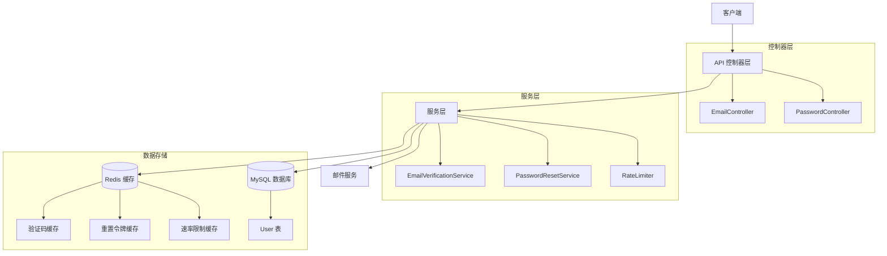

# Design Document: 邮箱验证和密码找回功能

## Overview

本设计文档描述了 Yii2 API 系统的邮箱验证和密码找回功能的技术实现方案。该功能提供五个 RESTful API 端点，使用 Redis 缓存存储临时数据（验证码、重置令牌、速率限制信息），并集成到现有的 JWT 认证系统中。

核心设计原则：
- **无状态 API 设计**：所有临时状态存储在 Redis 中，不污染数据库
- **安全优先**：多层防护机制（速率限制、尝试次数限制、令牌加密）
- **高性能**：利用 Redis 缓存减少数据库查询
- **可扩展性**：模块化设计，易于添加新的验证方式

## Architecture

### 系统架构图



### 技术栈

- **框架**: Yii2 Framework
- **缓存**: Redis (用于临时数据存储)
- **数据库**: MySQL (用于持久化用户数据)
- **认证**: JWT (JSON Web Token)
- **邮件**: Yii2 Mailer (SwiftMailer)
- **安全**: Yii2 Security Component

### 数据流

1. **邮箱验证流程**:
   ```
   用户请求验证码 → 生成验证码 → 存入 Redis → 发送邮件 → 用户提交验证码 → 验证并更新数据库 → 清理 Redis
   ```

2. **密码重置流程**:
   ```
   用户请求重置 → 检查邮箱验证状态 → 生成令牌 → 存入 Redis → 发送邮件 → 用户提交新密码 → 验证令牌 → 更新密码 → 清理 Redis
   ```

## Components and Interfaces

### 1. EmailController

负责处理邮箱验证相关的 API 请求。

**端点**:
- `POST /v1/email/send-verification` - 发送验证码
- `POST /v1/email/verify` - 验证验证码

**方法签名**:

```php
class EmailController extends Controller
{
    /**
     * 发送邮箱验证码
     * @return array 响应数据
     */
    public function actionSendVerification(): array
    {
        // 参数: email (string)
        // 返回: {success: true, message: "验证码已发送"}
    }
    
    /**
     * 验证邮箱验证码
     * @return array 响应数据
     */
    public function actionVerify(): array
    {
        // 参数: email (string), code (string)
        // 返回: {success: true, message: "邮箱验证成功"}
    }
}
```

### 2. PasswordController

负责处理密码重置相关的 API 请求。

**端点**:
- `POST /v1/password/request-reset` - 请求密码重置
- `POST /v1/password/verify-token` - 验证重置令牌
- `POST /v1/password/reset` - 重置密码

**方法签名**:

```php
class PasswordController extends Controller
{
    /**
     * 请求密码重置
     * @return array 响应数据
     */
    public function actionRequestReset(): array
    {
        // 参数: email (string)
        // 返回: {success: true, message: "重置链接已发送"}
    }
    
    /**
     * 验证重置令牌
     * @return array 响应数据
     */
    public function actionVerifyToken(): array
    {
        // 参数: token (string)
        // 返回: {success: true, valid: true}
    }
    
    /**
     * 重置密码
     * @return array 响应数据
     */
    public function actionReset(): array
    {
        // 参数: token (string), password (string)
        // 返回: {success: true, message: "密码重置成功"}
    }
}
```

### 3. EmailVerificationService

核心服务类，处理邮箱验证的业务逻辑。

**方法签名**:

```php
class EmailVerificationService
{
    /**
     * 生成并发送验证码
     * @param string $email 邮箱地址
     * @return bool 是否成功
     * @throws RateLimitException 速率限制异常
     */
    public function sendVerificationCode(string $email): bool;
    
    /**
     * 验证验证码
     * @param string $email 邮箱地址
     * @param string $code 验证码
     * @return bool 是否验证成功
     * @throws InvalidCodeException 验证码无效异常
     * @throws AccountLockedException 账户锁定异常
     */
    public function verifyCode(string $email, string $code): bool;
    
    /**
     * 生成 6 位数字验证码
     * @return string 验证码
     */
    protected function generateVerificationCode(): string;
    
    /**
     * 检查验证尝试次数
     * @param string $email 邮箱地址
     * @return bool 是否被锁定
     */
    protected function isLocked(string $email): bool;
    
    /**
     * 增加验证失败次数
     * @param string $email 邮箱地址
     * @return int 当前失败次数
     */
    protected function incrementAttempts(string $email): int;
    
    /**
     * 标记邮箱为已验证
     * @param string $email 邮箱地址
     * @return bool 是否成功
     */
    protected function markEmailAsVerified(string $email): bool;
}
```

### 4. PasswordResetService

核心服务类，处理密码重置的业务逻辑。

**方法签名**:

```php
class PasswordResetService
{
    /**
     * 生成并发送密码重置令牌
     * @param string $email 邮箱地址
     * @return bool 是否成功
     * @throws EmailNotVerifiedException 邮箱未验证异常
     * @throws RateLimitException 速率限制异常
     */
    public function sendResetToken(string $email): bool;
    
    /**
     * 验证重置令牌
     * @param string $token 重置令牌
     * @return bool 令牌是否有效
     */
    public function verifyResetToken(string $token): bool;
    
    /**
     * 重置密码
     * @param string $token 重置令牌
     * @param string $newPassword 新密码
     * @return bool 是否成功
     * @throws InvalidTokenException 令牌无效异常
     */
    public function resetPassword(string $token, string $newPassword): bool;
    
    /**
     * 生成加密的重置令牌
     * @return string 令牌
     */
    protected function generateResetToken(): string;
    
    /**
     * 检查邮箱是否已验证
     * @param string $email 邮箱地址
     * @return bool 是否已验证
     */
    protected function isEmailVerified(string $email): bool;
    
    /**
     * 使所有用户会话失效
     * @param int $userId 用户 ID
     * @return bool 是否成功
     */
    protected function invalidateUserSessions(int $userId): bool;
}
```

### 5. RateLimiter

速率限制服务，防止滥用。

**方法签名**:

```php
class RateLimiter
{
    /**
     * 检查是否超过速率限制
     * @param string $key 限制键
     * @param int $maxAttempts 最大尝试次数
     * @param int $decaySeconds 衰减时间（秒）
     * @return bool 是否超过限制
     */
    public function tooManyAttempts(string $key, int $maxAttempts, int $decaySeconds): bool;
    
    /**
     * 增加尝试次数
     * @param string $key 限制键
     * @param int $decaySeconds 衰减时间（秒）
     * @return int 当前尝试次数
     */
    public function hit(string $key, int $decaySeconds): int;
    
    /**
     * 获取剩余重试时间
     * @param string $key 限制键
     * @return int 剩余秒数
     */
    public function availableIn(string $key): int;
    
    /**
     * 清除限制
     * @param string $key 限制键
     * @return bool 是否成功
     */
    public function clear(string $key): bool;
}
```

### 6. RedisKeyManager

Redis 键管理器，统一管理缓存键格式。

**方法签名**:

```php
class RedisKeyManager
{
    /**
     * 获取验证码缓存键
     * @param string $email 邮箱地址
     * @return string Redis 键
     */
    public static function getVerificationCodeKey(string $email): string;
    // 返回: "email:verify:{email}"
    
    /**
     * 获取验证尝试次数缓存键
     * @param string $email 邮箱地址
     * @return string Redis 键
     */
    public static function getVerificationAttemptsKey(string $email): string;
    // 返回: "email:verify:attempts:{email}"
    
    /**
     * 获取重置令牌缓存键
     * @param string $token 令牌
     * @return string Redis 键
     */
    public static function getResetTokenKey(string $token): string;
    // 返回: "password:reset:{token}"
    
    /**
     * 获取速率限制缓存键
     * @param string $email 邮箱地址
     * @param string $action 操作类型
     * @return string Redis 键
     */
    public static function getRateLimitKey(string $email, string $action): string;
    // 返回: "email:ratelimit:{action}:{email}"
}
```

## Data Models

### User 模型扩展

需要在现有的 User 表中添加 `email_verified_at` 字段来记录邮箱验证状态。

**数据库迁移**:

```php
// Migration: m240101_000000_add_email_verified_at_to_user_table
public function up()
{
    $this->addColumn('{{%user}}', 'email_verified_at', $this->integer()->null()->comment('邮箱验证时间戳'));
}

public function down()
{
    $this->dropColumn('{{%user}}', 'email_verified_at');
}
```

**User 模型新增方法**:

```php
class User extends ActiveRecord
{
    /**
     * 检查邮箱是否已验证
     * @return bool
     */
    public function isEmailVerified(): bool
    {
        return $this->email_verified_at !== null;
    }
    
    /**
     * 标记邮箱为已验证
     * @return bool
     */
    public function markEmailAsVerified(): bool
    {
        $this->email_verified_at = time();
        return $this->save(false, ['email_verified_at']);
    }
    
    /**
     * 通过邮箱查找用户
     * @param string $email
     * @return User|null
     */
    public static function findByEmail(string $email): ?User
    {
        return static::findOne(['email' => $email]);
    }
}
```

### Redis 数据结构

**1. 验证码存储**:
```
键: email:verify:{email}
值: {code: "123456", created_at: 1234567890}
过期时间: 900 秒 (15 分钟)
```

**2. 验证尝试次数**:
```
键: email:verify:attempts:{email}
值: 3
过期时间: 900 秒 (15 分钟)
```

**3. 重置令牌存储**:
```
键: password:reset:{token}
值: {email: "user@example.com", user_id: 123, created_at: 1234567890}
过期时间: 1800 秒 (30 分钟)
```

**4. 速率限制**:
```
键: email:ratelimit:send_verification:{email}
值: 1
过期时间: 60 秒 (1 分钟)
```

### 表单模型

**SendVerificationForm**:
```php
class SendVerificationForm extends Model
{
    public $email;
    
    public function rules()
    {
        return [
            ['email', 'required'],
            ['email', 'email'],
            ['email', 'exist', 'targetClass' => User::class, 'targetAttribute' => 'email'],
        ];
    }
}
```

**VerifyEmailForm**:
```php
class VerifyEmailForm extends Model
{
    public $email;
    public $code;
    
    public function rules()
    {
        return [
            [['email', 'code'], 'required'],
            ['email', 'email'],
            ['code', 'string', 'length' => 6],
            ['code', 'match', 'pattern' => '/^\d{6}$/'],
        ];
    }
}
```

**RequestPasswordResetForm**:
```php
class RequestPasswordResetForm extends Model
{
    public $email;
    
    public function rules()
    {
        return [
            ['email', 'required'],
            ['email', 'email'],
            ['email', 'exist', 'targetClass' => User::class, 'targetAttribute' => 'email'],
        ];
    }
}
```

**ResetPasswordForm**:
```php
class ResetPasswordForm extends Model
{
    public $token;
    public $password;
    
    public function rules()
    {
        return [
            [['token', 'password'], 'required'],
            ['password', 'string', 'min' => 6, 'max' => 20],
            ['password', 'match', 'pattern' => '/^(?=.*[a-z])(?=.*[A-Z])(?=.*\d)(?=.*[\W_]).{6,}$/'],
        ];
    }
}
```


## Correctness Properties

*属性（Property）是关于系统行为的特征或规则，应该在所有有效执行中保持为真。属性是人类可读规范和机器可验证正确性保证之间的桥梁。通过属性测试，我们可以验证系统在各种输入下的正确性。*

### Property 1: 验证码格式正确性
*对于任何*生成的验证码，它必须是恰好 6 位的数字字符串，且每位都在 0-9 范围内。

**Validates: Requirements 1.1**

### Property 2: 验证码 Redis 存储正确性
*对于任何*存储到 Redis 的验证码，使用正确的键格式 `email:verify:{email}`，并且 TTL 设置为 900 秒（15 分钟），存储后能够成功检索。

**Validates: Requirements 1.2, 7.1**

### Property 3: 速率限制一致性
*对于任何*邮箱地址和操作类型（发送验证码或请求重置），在 1 分钟内的第二次请求必须被拒绝，并返回 HTTP 429 状态码和 retry_after 字段。

**Validates: Requirements 1.4, 3.6, 6.2, 8.4**

### Property 4: 验证码响应安全性
*对于任何*成功发送验证码的响应，响应体中不应包含验证码的实际值，只包含成功标识。

**Validates: Requirements 1.5**

### Property 5: 验证码匹配后状态更新
*对于任何*邮箱地址，当提交的验证码与 Redis 中存储的验证码匹配时，User 表中的 email_verified_at 字段必须被更新为当前时间戳。

**Validates: Requirements 2.2, 9.1**

### Property 6: 验证失败计数递增
*对于任何*邮箱地址，每次验证码验证失败时，Redis 中的错误计数必须递增 1，并且该计数的 TTL 为 900 秒（15 分钟）。

**Validates: Requirements 2.3, 7.2**

### Property 7: 验证失败锁定机制
*对于任何*邮箱地址，当验证失败次数达到 5 次时，后续的验证尝试必须被拒绝，并返回锁定错误信息和剩余锁定时间，直到 15 分钟后锁定自动解除。

**Validates: Requirements 2.4, 6.3, 6.4**

### Property 8: 验证成功后清理
*对于任何*成功验证的邮箱，验证码和错误计数的 Redis 键必须被删除。

**Validates: Requirements 2.6, 7.5**

### Property 9: 密码重置前置条件
*对于任何*请求密码重置的邮箱地址，如果该邮箱的 email_verified_at 字段为 NULL，请求必须被拒绝并返回 HTTP 400 错误。

**Validates: Requirements 3.1, 3.2, 9.3**

### Property 10: 重置令牌生成和存储
*对于任何*已验证的邮箱请求密码重置，系统必须生成一个至少 32 字符的加密随机令牌，并使用键格式 `password:reset:{token}` 存储到 Redis，TTL 为 1800 秒（30 分钟）。

**Validates: Requirements 3.3, 3.4, 7.3**

### Property 11: 重置令牌有效性验证
*对于任何*提交的重置令牌，如果该令牌在 Redis 中存在且未过期，验证接口必须返回有效响应；如果不存在或已被使用，必须返回无效令牌错误。

**Validates: Requirements 4.1, 4.2, 4.4**

### Property 12: 密码重置成功后的操作
*对于任何*使用有效令牌的密码重置操作，密码必须被更新，重置令牌必须从 Redis 中删除，并且该用户的所有 RefreshToken 记录必须被删除（使会话失效）。

**Validates: Requirements 5.3, 5.4, 5.5**

### Property 13: 密码安全要求验证
*对于任何*提交的新密码，如果不满足安全要求（长度 6-20 字符，包含大小写字母、数字和特殊字符），必须被拒绝并返回 HTTP 400 验证错误。

**Validates: Requirements 5.6, 8.5**

### Property 14: Redis 键格式一致性
*对于所有*Redis 操作，验证码使用 `email:verify:{email}`，验证尝试次数使用 `email:verify:attempts:{email}`，重置令牌使用 `password:reset:{token}`，速率限制使用 `email:ratelimit:{action}:{email}`，且各自的 TTL 分别为 900、900、1800、60 秒。

**Validates: Requirements 7.1, 7.2, 7.3, 7.4**

### Property 15: 成功响应格式一致性
*对于所有*成功的 API 操作，响应必须包含 HTTP 200 状态码和包含 `success: true` 字段的 JSON 对象。

**Validates: Requirements 8.1**

### Property 16: 错误响应格式一致性
*对于所有*失败的 API 操作，响应必须包含适当的 HTTP 错误状态码（400/401/429/500）和包含 `error` 字段的 JSON 对象，且错误消息必须是描述性的。

**Validates: Requirements 8.2, 8.3**

### Property 17: 邮箱验证状态判断
*对于任何*用户，当 email_verified_at 字段不为 NULL 时，isEmailVerified() 方法必须返回 true；当为 NULL 时必须返回 false。

**Validates: Requirements 9.2, 9.3, 9.4**

### Property 18: 日志记录完整性
*对于所有*关键操作（发送验证码、验证失败、密码重置成功、安全错误），必须记录日志，且日志中不包含敏感信息（验证码、密码、完整令牌）。

**Validates: Requirements 10.1, 10.2, 10.3, 10.4, 10.5**

### Property 19: 随机数生成安全性
*对于所有*验证码和重置令牌的生成，必须使用 Yii2 Security 组件的 generateRandomString() 方法，确保加密安全的随机性。

**Validates: Requirements 6.5**

## Error Handling

### 错误类型和处理策略

**1. 验证错误 (HTTP 400)**:
- 邮箱格式无效
- 验证码格式错误（非 6 位数字）
- 密码不符合安全要求
- 必填字段缺失

处理方式：返回详细的验证错误信息，指明哪个字段不符合要求。

**2. 业务逻辑错误 (HTTP 400)**:
- 邮箱未验证（请求密码重置时）
- 验证码不匹配
- 重置令牌无效或已过期
- 用户不存在

处理方式：返回清晰的错误消息，指导用户如何解决问题。

**3. 速率限制错误 (HTTP 429)**:
- 1 分钟内重复发送验证码
- 1 分钟内重复请求密码重置
- 验证失败 5 次后被锁定

处理方式：返回 429 状态码和 retry_after 字段，告知用户需要等待的时间。

**4. 系统错误 (HTTP 500)**:
- Redis 连接失败
- 数据库操作失败
- 邮件发送失败

处理方式：记录详细错误日志，返回通用错误消息给用户，避免泄露系统内部信息。

### 异常类定义

```php
// 自定义异常类
class RateLimitException extends \yii\web\TooManyRequestsHttpException {}
class InvalidCodeException extends \yii\web\BadRequestHttpException {}
class AccountLockedException extends \yii\web\TooManyRequestsHttpException {}
class EmailNotVerifiedException extends \yii\web\BadRequestHttpException {}
class InvalidTokenException extends \yii\web\BadRequestHttpException {}
```

### 错误响应格式

```json
{
  "success": false,
  "error": {
    "code": "RATE_LIMIT_EXCEEDED",
    "message": "请求过于频繁，请稍后再试",
    "retry_after": 45
  }
}
```

### 日志记录策略

- **Info 级别**: 正常操作（发送验证码、验证成功、密码重置成功）
- **Warning 级别**: 安全相关事件（验证失败、账户锁定、令牌失效）
- **Error 级别**: 系统错误（Redis 故障、数据库错误、邮件发送失败）

日志格式：
```
[2024-01-01 12:00:00] [INFO] Email verification code sent to user@example.com
[2024-01-01 12:01:00] [WARNING] Email verification failed for user@example.com (attempt 3/5)
[2024-01-01 12:05:00] [WARNING] Account locked for user@example.com (too many failed attempts)
[2024-01-01 12:10:00] [INFO] Password reset successful for user ID: 123
[2024-01-01 12:15:00] [ERROR] Redis connection failed: Connection refused
```

## Testing Strategy

### 测试方法概述

本功能采用**双重测试策略**：单元测试和属性测试相结合，确保全面的代码覆盖和正确性验证。

- **单元测试**：验证特定示例、边缘情况和错误条件
- **属性测试**：验证通用属性在所有输入下的正确性

两种测试方法是互补的，单元测试关注具体场景，属性测试通过随机化输入覆盖大量情况。

### 属性测试配置

**测试库选择**: 使用 [PHP-QuickCheck](https://github.com/steos/php-quickcheck) 进行属性测试。

**配置要求**:
- 每个属性测试最少运行 **100 次迭代**（由于随机化特性）
- 每个测试必须引用设计文档中的对应属性
- 标签格式: `@group Feature: email-verification-and-password-reset, Property {N}: {property_text}`

**安装**:
```bash
composer require --dev steos/quickcheck
```

### 单元测试计划

**EmailVerificationServiceTest**:
- 测试验证码生成格式
- 测试 Redis 存储和检索
- 测试速率限制边界条件
- 测试验证失败计数
- 测试账户锁定和解锁
- 测试邮件发送集成（使用 mock）

**PasswordResetServiceTest**:
- 测试令牌生成和格式
- 测试邮箱验证状态检查
- 测试令牌有效性验证
- 测试密码更新
- 测试会话失效
- 测试一次性令牌机制

**RateLimiterTest**:
- 测试速率限制计数
- 测试过期时间
- 测试清除功能

**RedisKeyManagerTest**:
- 测试所有键格式生成
- 测试键名唯一性

### 属性测试计划

**Property 1-19 测试**:
每个设计文档中定义的属性都需要对应的属性测试。

示例属性测试（Property 1）:
```php
/**
 * @group Feature: email-verification-and-password-reset, Property 1: 验证码格式正确性
 */
public function testVerificationCodeFormatProperty()
{
    $this->forAll(
        Generator::int(1, 100) // 生成 100 次
    )->then(function ($iteration) {
        $service = new EmailVerificationService();
        $code = $service->generateVerificationCode();
        
        // 验证码必须是 6 位数字
        $this->assertMatchesRegularExpression('/^\d{6}$/', $code);
        $this->assertEquals(6, strlen($code));
    });
}
```

示例属性测试（Property 3）:
```php
/**
 * @group Feature: email-verification-and-password-reset, Property 3: 速率限制一致性
 */
public function testRateLimitConsistencyProperty()
{
    $this->forAll(
        Generator::email() // 生成随机邮箱
    )->then(function ($email) {
        $service = new EmailVerificationService();
        
        // 第一次请求应该成功
        $result1 = $service->sendVerificationCode($email);
        $this->assertTrue($result1);
        
        // 第二次请求应该被速率限制拒绝
        $this->expectException(RateLimitException::class);
        $service->sendVerificationCode($email);
    });
}
```

### 集成测试计划

**API 端点测试**:
- 测试完整的邮箱验证流程（发送 → 验证）
- 测试完整的密码重置流程（请求 → 验证令牌 → 重置）
- 测试跨端点的状态一致性
- 测试并发请求处理

**Redis 集成测试**:
- 测试 Redis 连接失败的降级处理
- 测试键过期机制
- 测试数据持久化

**邮件服务集成测试**:
- 测试邮件发送成功和失败场景
- 测试邮件内容格式
- 测试邮件模板渲染

### 测试数据管理

**测试前准备**:
- 清空 Redis 测试数据库
- 准备测试用户数据
- Mock 邮件服务

**测试后清理**:
- 删除测试用户
- 清空 Redis 测试键
- 重置 mock 对象

### 性能测试

虽然不是单元测试的一部分，但应该进行以下性能验证：
- Redis 操作响应时间 < 10ms
- API 端点响应时间 < 200ms（不包括邮件发送）
- 并发 100 个请求时的系统稳定性

### 测试覆盖率目标

- **代码覆盖率**: 最低 85%
- **分支覆盖率**: 最低 80%
- **属性测试覆盖**: 所有 19 个属性必须有对应的测试
- **关键路径覆盖**: 100%（邮箱验证和密码重置的主流程）
