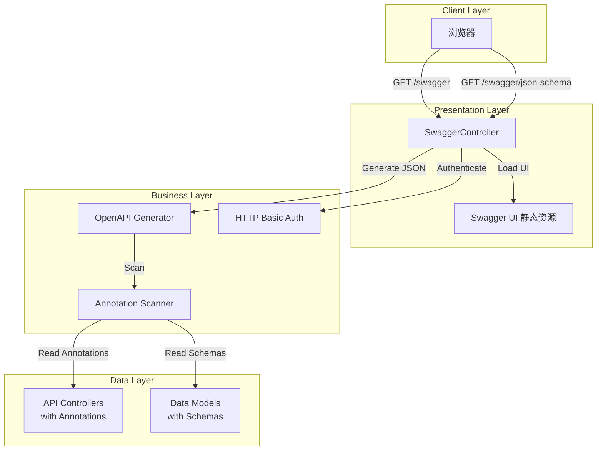

# Design Document: OpenAPI 3.0 Implementation

## Overview

本设计文档描述了为 Yii2 Advanced 项目实现 OpenAPI 3.0 文档系统的技术方案。该系统将使用 `zircote/swagger-php` 库通过 PHP 注解生成符合 OpenAPI 3.0 规范的 API 文档，并通过 Swagger UI 提供交互式文档界面。

### 核心目标

1. 为现有 API 端点生成标准化的 OpenAPI 3.0 文档
2. 提供 Swagger UI 界面供开发者查看和测试 API
3. 支持 JWT 认证机制的文档化
4. 支持多模块 API 的组织和展示
5. 提供访问控制保护文档安全

### 技术栈

- **OpenAPI 生成**: zircote/swagger-php ^4.0
- **注解解析**: doctrine/annotations ^2.0
- **UI 展示**: Swagger UI 5.x
- **认证**: HTTP Basic Authentication (文档访问) + JWT Bearer (API 调用)
- **框架**: Yii2 Advanced

## Architecture

### 系统架构图



### 架构层次说明

1. **Client Layer (客户端层)**
   - 用户通过浏览器访问 Swagger UI 界面

2. **Presentation Layer (展示层)**
   - `SwaggerController`: 处理文档请求，提供 UI 和 JSON Schema
   - `Swagger UI`: 静态资源，提供交互式文档界面

3. **Business Layer (业务层)**
   - `OpenAPI Generator`: 使用 swagger-php 生成 OpenAPI 文档
   - `Annotation Scanner`: 扫描 PHP 文件中的注解
   - `HTTP Basic Auth`: 保护文档访问

4. **Data Layer (数据层)**
   - `API Controllers`: 包含 OpenAPI 注解的控制器
   - `Data Models`: 包含 Schema 注解的数据模型


## Components and Interfaces

### 1. SwaggerController

核心控制器，负责提供 Swagger UI 界面和 OpenAPI JSON Schema。

#### 职责

- 渲染 Swagger UI HTML 页面
- 生成 OpenAPI 3.0 JSON Schema
- 实现 HTTP Basic Authentication 保护
- 配置文件扫描列表

#### 接口设计

```php
class SwaggerController extends Controller
{
    public $enableCsrfValidation = false;
    
    /**
     * 在执行任何操作前进行身份验证
     * @return bool
     */
    public function beforeAction($action): bool;
    
    /**
     * 渲染 Swagger UI 界面
     * @return string HTML content
     */
    public function actionIndex(): string;
    
    /**
     * 生成 OpenAPI JSON Schema
     * @return array JSON data
     */
    public function actionJsonSchema(): array;
}
```

#### 关键实现细节

**认证机制** (基于 SWAGGER_CONFIG.md 方案 A):
- 从 `config/params.php` 读取认证凭据
- 支持环境变量配置 (`SWAGGER_USERNAME`, `SWAGGER_PASSWORD`)
- 使用 PHP 原生 HTTP Basic Authentication
- 认证失败返回 401 状态码和 WWW-Authenticate 头

**文件扫描配置**:
```php
$scanFiles = [
    $baseDir . '/controllers/SwaggerController.php',
    $baseDir . '/controllers/SiteController.php',
    $baseDir . '/controllers/ServerController.php',
    $baseDir . '/modules/v1/controllers/UserController.php',
    $baseDir . '/modules/v1/models/User.php',
    $baseDir . '/modules/v1/models/UserInfo.php',
    // ... 其他文件
];
```

**Mixed-Content 问题解决**:
- 使用 `Yii::$app->urlManager->createUrl()` 生成相对路径
- 避免硬编码协议 (http/https)
- 确保 HTTPS 环境下正常工作


### 2. OpenAPI 注解系统

使用 swagger-php 库的注解来描述 API 结构。

#### 全局注解 (在 SwaggerController 中)

```php
/**
 * @OA\Info(
 *     version="1.0.0",
 *     title="Yii2 Advanced API",
 *     description="API 文档"
 * )
 * @OA\Server(url="/", description="API Server")
 * @OA\SecurityScheme(
 *     securityScheme="Bearer",
 *     type="http",
 *     scheme="bearer",
 *     bearerFormat="JWT"
 * )
 */
```

#### Controller 注解模式

```php
/**
 * @OA\Tag(
 *     name="User",
 *     description="用户管理相关接口"
 * )
 */
class UserController extends Controller
{
    /**
     * @OA\Get(
     *     path="/v1/user/info",
     *     summary="获取用户信息",
     *     tags={"User"},
     *     security={{"Bearer": {}}},
     *     @OA\Response(
     *         response=200,
     *         description="成功",
     *         @OA\JsonContent(ref="#/components/schemas/User")
     *     ),
     *     @OA\Response(response=401, description="未授权")
     * )
     */
    public function actionInfo() { }
}
```

#### Model Schema 注解模式

```php
/**
 * @OA\Schema(
 *     schema="User",
 *     title="用户",
 *     @OA\Property(property="id", type="integer", description="用户ID"),
 *     @OA\Property(property="username", type="string", description="用户名"),
 *     @OA\Property(property="nickname", type="string", description="昵称"),
 *     @OA\Property(property="roles", type="array", @OA\Items(type="string"))
 * )
 */
class User extends ActiveRecord { }
```


### 3. Swagger UI 集成

#### 静态资源结构

```
api/web/swagger-ui/
├── swagger-ui-bundle.js  (~1.4MB)
└── swagger-ui.css        (~150KB)
```

#### HTML 模板

SwaggerController 的 `actionIndex()` 返回的 HTML 结构：

```html
<!DOCTYPE html>
<html lang="zh-CN">
<head>
    <meta charset="UTF-8">
    <title>API 文档 - Swagger UI</title>
    <link rel="stylesheet" href="/swagger-ui/swagger-ui.css">
    <style>
        body { margin: 0; padding: 0; }
        .swagger-ui .topbar { display: none; }
    </style>
</head>
<body>
    <div id="swagger-ui"></div>
    <script src="/swagger-ui/swagger-ui-bundle.js"></script>
    <script>
        window.onload = function() {
            SwaggerUIBundle({
                url: "/swagger/json-schema",
                dom_id: '#swagger-ui',
                deepLinking: true,
                presets: [
                    SwaggerUIBundle.presets.apis,
                    SwaggerUIBundle.SwaggerUIStandalonePreset
                ],
                layout: "BaseLayout"
            });
        };
    </script>
</body>
</html>
```

### 4. 路由配置

在 `config/web.php` 的 `urlManager` 中添加：

```php
'urlManager' => [
    'enablePrettyUrl' => true,
    'showScriptName' => false,
    'enableStrictParsing' => true,
    'rules' => [
        'GET swagger' => 'swagger/index',
        'GET swagger/json-schema' => 'swagger/json-schema',
        // ... 其他路由
    ],
],
```

### 5. 配置管理

#### params.php 配置

```php
return [
    'swagger' => [
        'username' => getenv('SWAGGER_USERNAME') ?: 'swagger_admin',
        'password' => getenv('SWAGGER_PASSWORD') ?: 'YourStrongP@ssw0rd!',
        'enabled' => getenv('SWAGGER_ENABLED') !== 'false', // 生产环境可禁用
    ],
];
```

#### 环境变量 (.env)

```env
SWAGGER_USERNAME=swagger_admin
SWAGGER_PASSWORD=Pr0duct10n$ecureP@ss!
SWAGGER_ENABLED=true
```


## Data Models

### OpenAPI Document Structure

生成的 OpenAPI 3.0 文档结构：

```json
{
  "openapi": "3.0.0",
  "info": {
    "title": "Yii2 Advanced API",
    "version": "1.0.0"
  },
  "servers": [
    {
      "url": "/",
      "description": "API Server"
    }
  ],
  "paths": {
    "/site/login": {
      "post": {
        "tags": ["Authentication"],
        "summary": "用户登录",
        "requestBody": { },
        "responses": { }
      }
    }
  },
  "components": {
    "schemas": {
      "User": { },
      "ErrorResponse": { }
    },
    "securitySchemes": {
      "Bearer": {
        "type": "http",
        "scheme": "bearer",
        "bearerFormat": "JWT"
      }
    }
  }
}
```

### 标准错误响应 Schema

```php
/**
 * @OA\Schema(
 *     schema="ErrorResponse",
 *     title="错误响应",
 *     @OA\Property(property="name", type="string", description="错误名称"),
 *     @OA\Property(property="message", type="string", description="错误消息"),
 *     @OA\Property(property="code", type="integer", description="错误码"),
 *     @OA\Property(property="status", type="integer", description="HTTP状态码")
 * )
 */
```

### 模块标签映射

| 模块 | 标签名 | 描述 |
|------|--------|------|
| SiteController | Authentication | 认证相关接口 |
| ServerController | Server | 服务器管理接口 |
| v1/UserController | User | 用户管理接口 |
| a1/* | Admin | 管理员接口 |
| private/* | Private | 私有接口 |
| vp/* | VirtualPlay | 虚拟游戏接口 |


## Correctness Properties

*属性（Property）是关于系统行为的普遍规则，应该在所有有效执行中保持为真。属性是人类可读规范和机器可验证正确性保证之间的桥梁。*

### Property Reflection

在分析了所有可测试的接受标准后，我识别出以下需要验证的属性。许多需求涉及代码规范和注解内容，这些不适合自动化测试，而应通过代码审查来验证。以下属性专注于可以通过自动化测试验证的系统行为。

**Property 1: OpenAPI 规范合规性**
*对于任何*生成的 OpenAPI 文档，该文档应该通过 OpenAPI 3.0 规范验证器的验证
**Validates: Requirements 1.2**

**Property 2: 注解端点完整性**
*对于任何*包含 OpenAPI 注解的控制器文件，生成的文档应该包含该文件中所有带注解的端点
**Validates: Requirements 1.3**

**Property 3: Schema 完整性**
*对于任何*包含 @OA\Schema 注解的模型文件，生成的文档应该在 components/schemas 中包含该 Schema 定义
**Validates: Requirements 1.4**

**Property 4: 多模块扫描**
*对于任何*配置的 API 模块目录（v1, a1, private, vp），扫描器应该能够发现并包含该模块中所有带注解的控制器
**Validates: Requirements 6.1**

**Property 5: 标签分组**
*对于任何*生成的端点，该端点应该至少有一个标签用于在 Swagger UI 中分组显示
**Validates: Requirements 6.2**

**Property 6: 示例数据一致性**
*对于任何*包含示例数据的 Schema，该示例数据应该通过 Schema 定义的验证
**Validates: Requirements 9.6**

**Property 7: HTTP Basic Auth 保护**
*对于任何*对 Swagger 端点的未认证请求，系统应该返回 401 状态码并要求认证
**Validates: Requirements 10.3, 10.5**


## Error Handling

### 错误类型和处理策略

#### 1. 认证错误

**场景**: 用户未提供或提供错误的认证凭据

**处理**:
```php
if ($username !== $swaggerConfig['username'] || $password !== $swaggerConfig['password']) {
    header('WWW-Authenticate: Basic realm="Swagger API Documentation"');
    header('HTTP/1.0 401 Unauthorized');
    echo '需要认证才能访问 API 文档';
    exit;
}
```

**响应**: 401 Unauthorized + WWW-Authenticate 头

#### 2. 配置缺失错误

**场景**: params.php 中缺少 swagger 配置

**处理**:
```php
$swaggerConfig = Yii::$app->params['swagger'] ?? null;
if (!$swaggerConfig) {
    throw new \yii\web\ServerErrorHttpException('Swagger 配置未找到');
}
```

**响应**: 500 Internal Server Error

#### 3. 文件扫描错误

**场景**: 配置的扫描文件不存在

**处理**:
```php
$existingFiles = array_filter($scanFiles, 'file_exists');
if (empty($existingFiles)) {
    return [
        'error' => 'No files found to scan',
        'baseDir' => $baseDir,
        'attempted' => $scanFiles
    ];
}
```

**响应**: 返回详细的错误信息 JSON

#### 4. OpenAPI 生成错误

**场景**: swagger-php 解析注解时出错

**处理**:
```php
try {
    $openapi = Generator::scan($existingFiles, ['validate' => false]);
    return json_decode($openapi->toJson());
} catch (\Exception $e) {
    Yii::error('OpenAPI generation failed: ' . $e->getMessage());
    return [
        'error' => 'Failed to generate OpenAPI schema',
        'message' => YII_DEBUG ? $e->getMessage() : 'Internal error'
    ];
}
```

**响应**: 返回错误信息，生产环境隐藏详细信息

#### 5. 环境禁用错误

**场景**: 生产环境禁用了 Swagger 访问

**处理**:
```php
public function beforeAction($action)
{
    if (!Yii::$app->params['swagger']['enabled']) {
        throw new \yii\web\NotFoundHttpException('API documentation is disabled');
    }
    return parent::beforeAction($action);
}
```

**响应**: 404 Not Found


### 错误响应标准格式

所有 API 端点的错误响应应遵循统一格式：

```json
{
  "name": "Bad Request",
  "message": "Invalid input data",
  "code": 0,
  "status": 400
}
```

对应的 OpenAPI Schema:

```php
/**
 * @OA\Schema(
 *     schema="ErrorResponse",
 *     title="错误响应",
 *     required={"name", "message", "code", "status"},
 *     @OA\Property(property="name", type="string", description="错误名称", example="Bad Request"),
 *     @OA\Property(property="message", type="string", description="错误详细消息", example="Invalid input data"),
 *     @OA\Property(property="code", type="integer", description="应用错误码", example=0),
 *     @OA\Property(property="status", type="integer", description="HTTP状态码", example=400)
 * )
 */
```

### 常见 HTTP 状态码

| 状态码 | 场景 | 示例 |
|--------|------|------|
| 200 | 成功 | 数据获取成功 |
| 201 | 创建成功 | 用户注册成功 |
| 400 | 请求错误 | 参数验证失败 |
| 401 | 未认证 | Token 缺失或无效 |
| 403 | 无权限 | 访问被拒绝 |
| 404 | 未找到 | 资源不存在 |
| 422 | 验证失败 | 表单验证错误 |
| 500 | 服务器错误 | 内部错误 |

## Testing Strategy

### 测试方法

本项目采用**双重测试策略**：

1. **单元测试**: 验证特定示例、边缘情况和错误条件
2. **属性测试**: 验证跨所有输入的通用属性

两者互补，共同提供全面的测试覆盖：
- 单元测试捕获具体的 bug
- 属性测试验证通用正确性

### 测试工具

- **PHP 单元测试**: PHPUnit
- **属性测试**: 手动实现简单的属性验证（PHP 没有成熟的 PBT 库）
- **OpenAPI 验证**: openapi-spec-validator (Python) 或在线验证工具
- **HTTP 测试**: Guzzle HTTP Client

### 单元测试重点

单元测试应专注于：

1. **具体示例**
   - SwaggerController 返回正确的 HTML
   - JSON Schema 包含预期的端点
   - 认证凭据验证

2. **边缘情况**
   - 空的扫描文件列表
   - 不存在的文件路径
   - 无效的注解语法

3. **错误条件**
   - 认证失败场景
   - 配置缺失场景
   - 文件读取失败

4. **集成点**
   - 路由配置正确
   - 静态资源可访问
   - CORS 头正确设置


### 属性测试配置

由于 PHP 缺少成熟的属性测试库，我们将实现简化的属性验证：

```php
/**
 * Feature: openapi-3-implementation, Property 1: OpenAPI 规范合规性
 * 
 * 验证生成的文档符合 OpenAPI 3.0 规范
 */
public function testOpenAPISpecCompliance()
{
    // 生成文档
    $schema = $this->generateSchema();
    
    // 使用外部验证器验证
    $validator = new OpenAPIValidator();
    $result = $validator->validate($schema);
    
    $this->assertTrue($result->isValid(), 
        'Generated OpenAPI schema should be valid');
}
```

每个属性测试应：
- 在注释中标注对应的设计属性编号
- 使用格式: `Feature: {feature_name}, Property {number}: {property_text}`
- 验证通用规则而非特定值

### 测试覆盖目标

| 组件 | 单元测试 | 属性测试 | 集成测试 |
|------|----------|----------|----------|
| SwaggerController | ✓ | ✓ | ✓ |
| 注解扫描 | ✓ | ✓ | - |
| HTTP Basic Auth | ✓ | ✓ | - |
| OpenAPI 生成 | ✓ | ✓ | - |
| Swagger UI | - | - | ✓ |

### 测试数据

**测试用控制器**:
```php
/**
 * @OA\Tag(name="Test", description="测试接口")
 */
class TestController extends Controller
{
    /**
     * @OA\Get(
     *     path="/test",
     *     tags={"Test"},
     *     @OA\Response(response=200, description="成功")
     * )
     */
    public function actionIndex() { }
}
```

**测试用模型**:
```php
/**
 * @OA\Schema(
 *     schema="TestModel",
 *     @OA\Property(property="id", type="integer"),
 *     @OA\Property(property="name", type="string")
 * )
 */
class TestModel { }
```

### 持续集成

测试应在以下情况下运行：
- 每次代码提交
- Pull Request 创建时
- 部署前

CI 配置示例 (.github/workflows/test.yml):
```yaml
name: Tests
on: [push, pull_request]
jobs:
  test:
    runs-on: ubuntu-latest
    steps:
      - uses: actions/checkout@v2
      - name: Setup PHP
        uses: shivammathur/setup-php@v2
        with:
          php-version: '8.1'
      - name: Install dependencies
        run: composer install
      - name: Run tests
        run: vendor/bin/phpunit
```

## Implementation Notes

### 开发顺序

1. **Phase 1: 基础设施**
   - 安装依赖
   - 下载 Swagger UI 静态资源
   - 创建 SwaggerController 基本结构

2. **Phase 2: 核心功能**
   - 实现文档生成逻辑
   - 配置文件扫描
   - 添加全局注解

3. **Phase 3: 安全性**
   - 实现 HTTP Basic Authentication
   - 配置环境变量
   - 添加生产环境保护

4. **Phase 4: 注解标注**
   - 为现有控制器添加注解
   - 为数据模型添加 Schema
   - 定义错误响应 Schema

5. **Phase 5: 测试和优化**
   - 编写单元测试
   - 编写属性测试
   - 性能优化

### 性能考虑

1. **文件扫描优化**
   - 只扫描必要的文件
   - 避免扫描整个目录树
   - 考虑缓存生成的文档

2. **生产环境优化**
   - 预生成静态 JSON 文件
   - 使用 CDN 托管 Swagger UI 资源
   - 启用 HTTP 缓存头

3. **内存优化**
   - 分批处理大量文件
   - 及时释放不需要的对象

### 安全考虑

1. **认证保护**
   - 使用强密码（16+ 字符）
   - 定期轮换密码
   - 生产环境必须启用认证

2. **信息泄露防护**
   - 不在错误消息中暴露敏感信息
   - 生产环境禁用详细错误
   - 考虑 IP 白名单

3. **CSRF 保护**
   - Swagger 端点禁用 CSRF（只读操作）
   - API 端点保持 CSRF 保护

### 维护指南

**添加新端点**:
1. 在控制器中添加 OpenAPI 注解
2. 将文件添加到 SwaggerController 的扫描列表
3. 刷新文档验证显示

**更新文档**:
1. 修改注解内容
2. 访问 `/swagger/json-schema` 查看更新
3. 在 Swagger UI 中验证

**故障排查**:
- 检查浏览器控制台错误
- 验证 JSON Schema 格式
- 检查文件路径是否正确
- 确认注解语法正确
