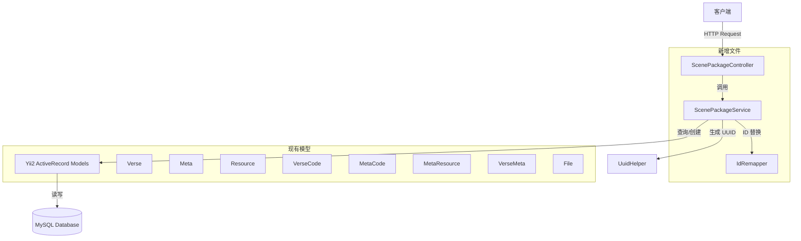
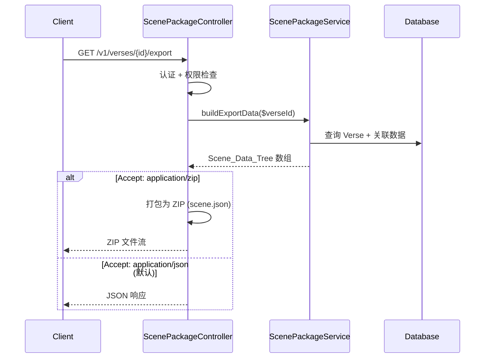
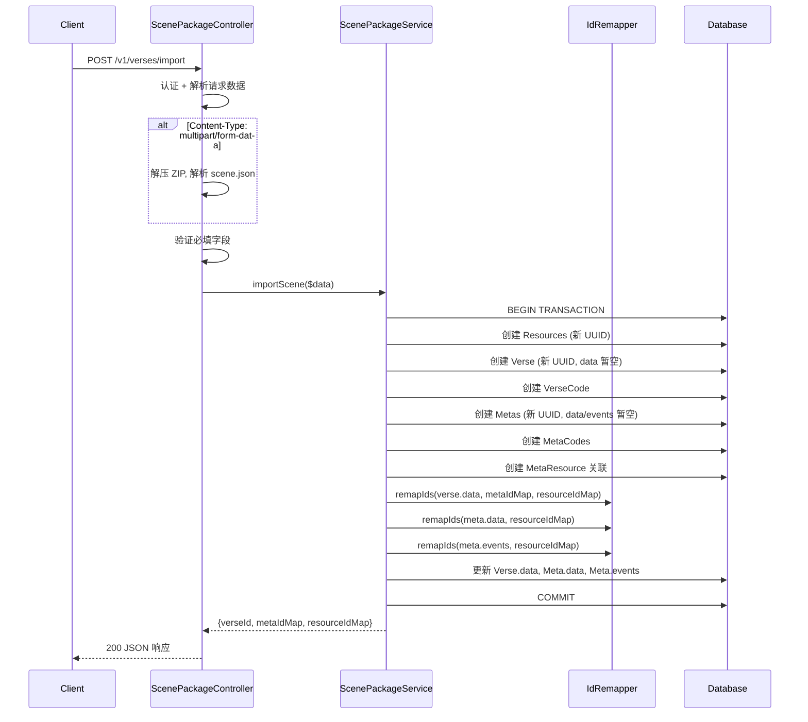

# 设计文档：场景包导出/导入 API

## 概述

本设计采用方案 B（新建 Service 层 + 独立 Controller），为场景系统新增两个 API 端点：导出（`GET /v1/verses/{id}/export`）和导入（`POST /v1/verses/import`）。核心业务逻辑封装在 `ScenePackageService` 中，`ScenePackageController` 作为薄层 Controller 负责请求解析、格式协商和响应构建。两个端点均支持 JSON 和 ZIP 两种格式，通过 HTTP 头（Accept / Content-Type）区分。

ID 重映射逻辑提取为独立的 `IdRemapper` 工具类，便于单元测试和复用。

## 架构



### 请求流程

**导出流程：**


**导入流程：**


## 组件与接口

### 1. ScenePackageController

**文件位置：** `advanced/api/modules/v1/controllers/ScenePackageController.php`

继承 `\yii\rest\Controller`，使用 JWT 认证（与现有 VerseController 一致）。

```php
class ScenePackageController extends \yii\rest\Controller
{
    /**
     * GET /v1/verses/{id}/export
     * 根据 Accept 头返回 JSON 或 ZIP 格式的场景数据
     */
    public function actionExport(int $id): mixed;

    /**
     * POST /v1/verses/import
     * 根据 Content-Type 解析 JSON 请求体或 ZIP 文件上传
     */
    public function actionImport(): array;
}
```

**职责：**
- 认证和权限检查（JWT Bearer Token）
- 请求格式协商（Accept / Content-Type 头解析）
- 输入数据验证（必填字段检查）
- ZIP 文件的打包/解压
- 调用 ScenePackageService 处理业务逻辑
- 构建 HTTP 响应（JSON 或 ZIP 文件流）

### 2. ScenePackageService

**文件位置：** `advanced/api/modules/v1/services/ScenePackageService.php`

继承 `\yii\base\Component`，封装核心业务逻辑。

```php
class ScenePackageService extends \yii\base\Component
{
    /**
     * 构建导出数据树
     * @param int $verseId 场景 ID
     * @return array Scene_Data_Tree 结构
     * @throws NotFoundHttpException
     */
    public function buildExportData(int $verseId): array;

    /**
     * 执行场景导入（事务内）
     * @param array $data 解析后的场景数据
     * @return array {verseId, metaIdMap, resourceIdMap}
     * @throws \Exception 任何失败将触发事务回滚
     */
    public function importScene(array $data): array;
}
```

**职责：**
- 导出：查询 Verse 及所有关联数据，组装 Scene_Data_Tree
- 导入：在事务中按顺序创建实体、建立关联、执行 ID 重映射
- 调用 IdRemapper 进行 JSON 数据中的 ID 替换
- 调用 UuidHelper 生成新 UUID

### 3. IdRemapper

**文件位置：** `advanced/api/modules/v1/helpers/IdRemapper.php`

纯静态工具类，无状态，便于单元测试。

```php
class IdRemapper
{
    /**
     * 递归遍历 JSON 数据树，替换指定 key 的值
     * @param mixed $data JSON 解码后的数据（数组或标量）
     * @param array $replacements 替换规则数组，格式：
     *   [
     *     ['key' => 'meta_id', 'map' => [旧ID => 新ID, ...], 'numericOnly' => false],
     *     ['key' => 'resource', 'map' => [旧ID => 新ID, ...], 'numericOnly' => true],
     *   ]
     * @return mixed 替换后的数据
     */
    public static function remap(mixed $data, array $replacements): mixed;
}
```

**替换规则：**
- `key`：要匹配的 JSON 键名
- `map`：旧值到新值的映射表
- `numericOnly`：为 true 时仅替换数字类型的值（用于 `resource` 键，避免误替换字符串类型的 resource 值）

### 4. 路由配置

在 `advanced/api/config/main.php` 的 `urlManager.rules` 中添加：

```php
[
    'class' => 'yii\rest\UrlRule',
    'controller' => 'v1/scene-package',
    'pluralize' => false,
    'extraPatterns' => [
        'GET verses/<id:\d+>/export' => 'export',
        'POST verses/import' => 'import',
    ],
    'tokens' => [],
],
```

## 数据模型

### Scene_Data_Tree 结构（导出响应 / 导入请求）

```json
{
  "verse": {
    "id": 626,
    "author_id": 1,
    "name": "场景名称",
    "description": "描述",
    "info": null,
    "data": { "type": "Verse", "children": { "modules": [...] } },
    "version": 3,
    "uuid": "verse-uuid-xxx",
    "editable": true,
    "viewable": true,
    "verseRelease": null,
    "image": { "id": 10, "md5": "...", "type": "image/png", "url": "https://...", "filename": "...", "size": 1024, "key": "..." },
    "verseCode": { "blockly": "...", "lua": "...", "js": "..." }
  },
  "metas": [
    {
      "id": 101,
      "author_id": 1,
      "uuid": "meta-uuid-aaa",
      "title": "实体A",
      "data": { "type": "MetaRoot", "children": {} },
      "events": { "inputs": [], "outputs": [] },
      "image_id": null,
      "image": null,
      "prefab": 0,
      "resources": [],
      "editable": true,
      "viewable": true,
      "metaCode": { "blockly": "...", "lua": "..." }
    }
  ],
  "resources": [
    {
      "id": 201,
      "uuid": "res-uuid-111",
      "name": "模型A",
      "type": "polygen",
      "info": "{...}",
      "created_at": "2025-01-15T08:00:00Z",
      "file": { "id": 301, "md5": "abc123", "type": "model/gltf-binary", "url": "https://...", "filename": "model.glb", "size": 524288, "key": "res-uuid-111.glb" }
    }
  ],
  "metaResourceLinks": [
    { "meta_id": 101, "resource_id": 201 }
  ]
}
```

### 导入请求体结构（JSON 格式）

```json
{
  "verse": {
    "name": "场景名称",
    "description": "描述",
    "data": "{\"type\":\"Verse\",...}",
    "version": 3,
    "uuid": "原始-verse-uuid",
    "verseCode": { "blockly": "...", "lua": "...", "js": "..." }
  },
  "metas": [
    {
      "title": "实体A",
      "data": "{\"type\":\"MetaRoot\",...}",
      "events": "{\"inputs\":[],\"outputs\":[]}",
      "uuid": "原始-meta-uuid",
      "metaCode": { "blockly": "...", "lua": "..." },
      "resourceFileIds": [501]
    }
  ],
  "resourceFileMappings": [
    {
      "originalUuid": "原始-resource-uuid",
      "fileId": 501,
      "name": "模型A",
      "type": "polygen",
      "info": "{...}"
    }
  ]
}
```

### 导入响应结构

```json
{
  "verseId": 700,
  "metaIdMap": { "原始-meta-uuid": 150 },
  "resourceIdMap": { "原始-resource-uuid": 250 }
}
```

### 实体关系图

```mermaid
erDiagram
    Verse ||--o| VerseCode : "has one"
    Verse ||--o{ VerseMeta : "has many"
    VerseMeta }o--|| Meta : "belongs to"
    Meta ||--o| MetaCode : "has one"
    Meta ||--o{ MetaResource : "has many"
    MetaResource }o--|| Resource : "belongs to"
    Resource }o--|| File : "has one"
    Verse ||--o| File : "image"

    Verse {
        int id PK
        int author_id FK
        string name
        string description
        text data
        int version
        string uuid UK
        int image_id FK
    }

    VerseCode {
        int id PK
        int verse_id FK_UK
        text blockly
        text lua
        text js
    }

    Meta {
        int id PK
        int author_id FK
        string uuid UK
        string title
        text data
        text events
        int image_id FK
        int prefab
    }

    MetaCode {
        int id PK
        int meta_id FK_UK
        text blockly
        text lua
        text js
    }

    Resource {
        int id PK
        string name
        string type
        string uuid UK
        int file_id FK
        string info
        int author_id FK
    }

    File {
        int id PK
        string md5
        string type
        string url
        string filename
        int size
        string key
    }

    VerseMeta {
        int id PK
        int verse_id FK
        int meta_id FK
    }

    MetaResource {
        int id PK
        int meta_id FK
        int resource_id FK
    }
```


## 正确性属性 (Correctness Properties)

*属性（Property）是指在系统所有有效执行中都应成立的特征或行为——本质上是关于系统应该做什么的形式化陈述。属性是人类可读规范与机器可验证正确性保证之间的桥梁。*

### Property 1: 导出数据树完整性

*For any* Verse 及其关联的 Metas、Resources、MetaResources，ScenePackageService.buildExportData() 返回的 Scene_Data_Tree 应满足：
- verse 对象包含所有必需字段（id、name、uuid、data、version）且 verseCode 存在时被包含
- metas 数组长度等于关联的 Meta 数量，每个 meta 包含 metaCode（如存在）
- resources 数组包含所有关联的 Resource，每个 resource 包含 file 对象（含 url、md5）
- metaResourceLinks 数组长度等于 MetaResource 关联记录数量

**Validates: Requirements 1.2, 1.3, 1.4, 1.5**

### Property 2: ZIP 序列化往返一致性

*For any* 有效的 Scene_Data_Tree 数据，将其序列化为 JSON 存入 ZIP 文件的 `scene.json`，再从 ZIP 中提取 `scene.json` 并反序列化，得到的数据应与原始数据等价。

**Validates: Requirements 2.2**

### Property 3: 导入实体创建完整性

*For any* 有效的导入数据（包含 verse、N 个 metas、M 个 resourceFileMappings），执行 importScene() 后：
- 数据库中新增恰好 1 个 Verse 记录
- 数据库中新增恰好 N 个 Meta 记录，且每个 Meta 通过 VerseMeta 关联到新 Verse
- 数据库中新增恰好 M 个 Resource 记录
- 如果 verse 包含 verseCode，则新增 1 个 VerseCode 记录
- 如果 meta 包含 metaCode，则新增对应数量的 MetaCode 记录
- 返回的 metaIdMap 包含 N 个条目，resourceIdMap 包含 M 个条目

**Validates: Requirements 4.1, 4.2, 4.3, 4.4, 4.5, 4.6, 4.7**

### Property 4: ID 重映射替换正确性

*For any* JSON 数据树和替换规则（key 名 + 旧值到新值的映射表），IdRemapper.remap() 执行后，结果数据树中所有匹配 key 的字段值应被替换为映射表中的新值，且不匹配的字段保持不变。

**Validates: Requirements 6.1, 6.2, 6.3, 6.4**

### Property 5: ID 重映射完整性不变量

*For any* JSON 数据树和完整的 ID 映射表（映射表覆盖数据中所有旧 ID），IdRemapper.remap() 执行后，结果数据树中不应存在任何旧 ID 值（即所有匹配的旧值均已被替换）。

**Validates: Requirements 6.5**

### Property 6: 导入 UUID 新鲜性

*For any* 导入数据中的原始 UUID 集合，导入完成后新创建的 Verse、所有 Meta、所有 Resource 的 UUID 均应与原始 UUID 不同，且每个新 UUID 符合 UUID v4 格式。

**Validates: Requirements 7.1, 7.2, 7.3**

### Property 7: 导入数据验证拒绝不完整数据

*For any* 导入数据，如果 verse 对象缺少任意必填字段（name、data、version、uuid），或 metas 元素缺少任意必填字段（title、uuid），或 resourceFileMappings 元素缺少任意必填字段（originalUuid、fileId、name、type、info），验证逻辑应拒绝该数据并返回 400 状态码。

**Validates: Requirements 9.2, 9.3, 9.4**

### Property 8: JSON 与 ZIP 导入等价性

*For any* 有效的场景数据，通过 JSON 请求体导入和通过 ZIP 文件（内含相同数据的 scene.json）导入，应产生结构等价的结果（相同数量的实体、相同的关联关系、相同的 ID 映射结构）。

**Validates: Requirements 5.2**

## 错误处理

| 场景 | HTTP 状态码 | 错误信息 | 处理方式 |
|------|------------|---------|---------|
| 未认证请求 | 401 | Unauthorized | JWT 认证行为自动处理 |
| 导出场景不存在 | 404 | Verse not found | Controller 查询后抛出 NotFoundHttpException |
| 导出无权限 | 403 | You are not authorized to access this verse | Controller 检查 viewable 属性后抛出 ForbiddenHttpException |
| 导入请求体缺少 verse | 400 | Missing required field: verse | Controller 验证层 |
| 导入必填字段缺失 | 400 | Missing required field: {field_name} | Controller 验证层，返回具体字段名 |
| 导入 fileId 不存在 | 422 | File not found for fileId: {id} | Service 层验证 File 记录存在性 |
| 导入 ZIP 格式无效 | 400 | Invalid ZIP file | Controller 解压失败时返回 |
| 导入 ZIP 缺少 scene.json | 400 | ZIP file does not contain scene.json | Controller 解压后检查 |
| 导入事务失败 | 500 | Import failed: {error_message} | Service 层捕获异常，事务回滚 |
| 模型验证失败 | 500 | Import failed: {model_errors} | Service 层在事务中检查 save() 返回值 |

### 错误响应格式

```json
{
  "name": "Bad Request",
  "message": "Missing required field: verse.name",
  "code": 0,
  "status": 400
}
```

遵循 Yii2 默认的错误响应格式（通过 HttpException 自动生成）。

## 测试策略

### 测试框架

- **单元测试 + 属性测试：** PHPUnit（已配置于 `advanced/phpunit.xml`）
- **属性测试库：** 使用 `eris/eris`（PHP 的 QuickCheck 风格属性测试库），通过 Composer 安装

### 属性测试 (Property-Based Tests)

每个正确性属性对应一个属性测试，最少运行 100 次迭代。

| 属性 | 测试文件 | 说明 |
|------|---------|------|
| Property 2: ZIP 往返 | `ScenePackagePropertyTest.php` | 生成随机 Scene_Data_Tree，序列化为 ZIP 再反序列化，验证等价 |
| Property 4: ID 重映射替换 | `IdRemapperPropertyTest.php` | 生成随机 JSON 树和映射表，验证所有匹配 key 被替换 |
| Property 5: ID 重映射完整性 | `IdRemapperPropertyTest.php` | 生成随机 JSON 树和完整映射表，验证无旧 ID 残留 |
| Property 7: 验证拒绝不完整数据 | `ImportValidationPropertyTest.php` | 生成随机不完整导入数据，验证验证逻辑拒绝 |

### 单元测试 (Unit Tests)

| 测试范围 | 测试文件 | 说明 |
|---------|---------|------|
| IdRemapper 基本功能 | `IdRemapperTest.php` | 测试具体的 JSON 替换场景（meta_id、resource、嵌套结构） |
| 导入数据验证 | `ImportValidationTest.php` | 测试各种缺失字段的具体场景 |
| 导出权限控制 | `ScenePackageControllerTest.php` | 测试 401/403/404 场景 |
| 导入事务回滚 | `ScenePackageServiceTest.php` | 模拟失败场景验证回滚 |
| ZIP 格式处理 | `ScenePackageControllerTest.php` | 测试 ZIP 打包/解压的边界情况 |

### 测试标注格式

每个属性测试必须包含注释引用设计文档中的属性编号：

```php
/**
 * Feature: scene-package-api, Property 4: ID 重映射替换正确性
 * Validates: Requirements 6.1, 6.2, 6.3, 6.4
 */
public function testIdRemapperReplacesAllMatchingKeys(): void
{
    // Property-based test with Eris
}
```

### 测试文件位置

所有测试文件放在 `advanced/tests/unit/services/` 和 `advanced/tests/unit/helpers/` 目录下。
